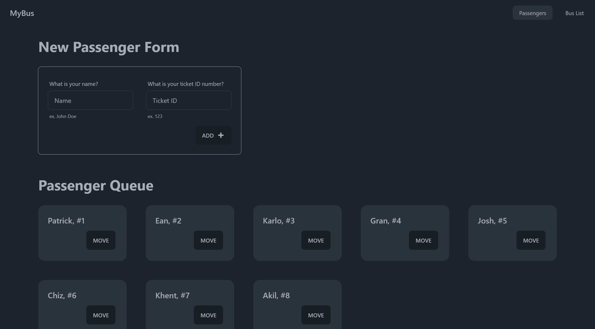
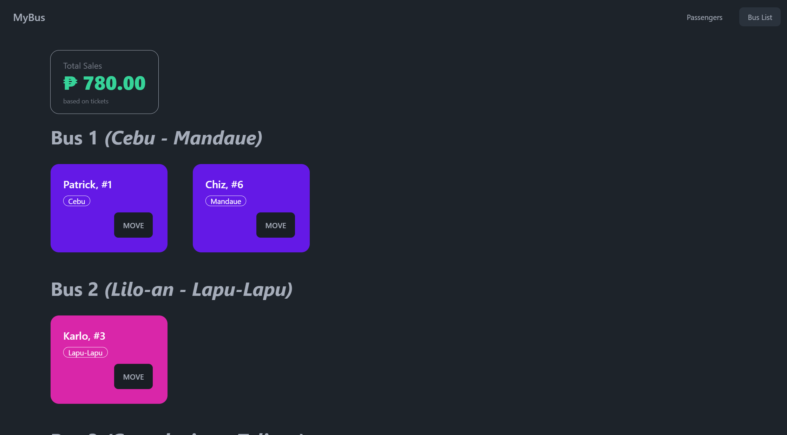

# Prompt

Create a Webpage using ReactJS for a Bus Queue and Loading System. The Webpage will have a Queue of Passengers with their Name, and ID, together with a List of possible destinations to choose from, and their prices.

When a destination is chosen the Passenger will be moved to the Corresponding Bus that will cater to that Specific Destination, and then removed from the Queue. After moving to the corresponding bus, the Total Sales will increment based on the price of the Destination the Passenger picked.

You are also given the option to add more Passengers to the Queue through a form, the form will simply accept the Passengers Name, and Ticket ID. The Ticket ID has to be unique, so if a user inputs a Ticket ID currently in the queue, it should display an error message.

- Bus 1 will cater to Passengers with the Destination of Cebu and Mandaue
- Bus 2 will cater to Passengers with the Destination of Lilo-an and Lapu-Lapu
- Bus 3 will cater to Passengers with the Destination of Consolacion and Talisay

You have full freedom when it comes to the design and look of the Web Page.

# Screenshots

## Landing Page

## Passengers & New Passengers Form

## Bus List of Passengers & Sales Dashboard

# Resources

- [Tailwind CSS: Utility-First CSS Framework](https://tailwindcss.com/)
- [Daisy UI: Tailwind CSS Component Library](https://daisyui.com/)
